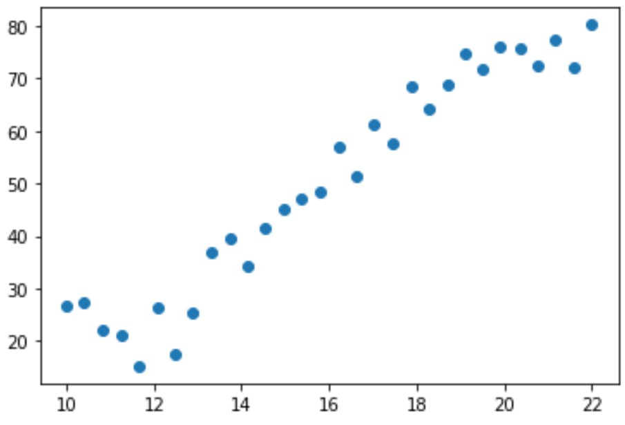
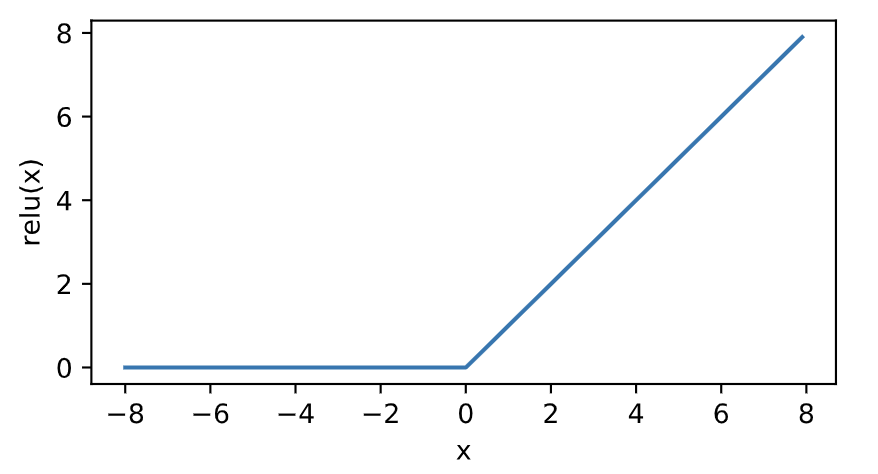
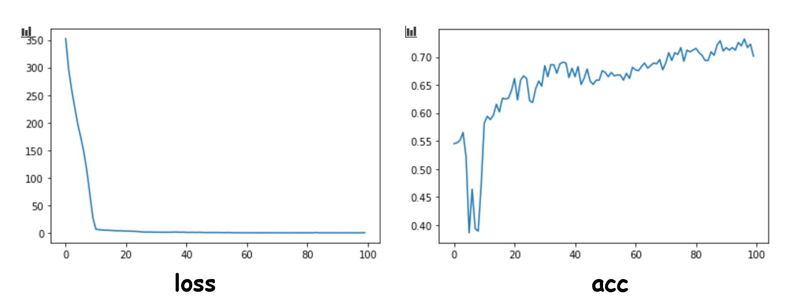

代码和其他资料在 [github](https://github.com/zhangasia/Tensorflow2)

#### 一、tf.keras概述

首先利用tf.keras实现一个简单的线性回归，如 $f(x) = ax + b$，其中 $x$ 代表学历，$f(x)$ 代表收入，分别代表输入特征和输出值。为了描述预测目标与真实值之间的整体误差最小，需要定义一个损失函数，数学描述为$(f(x) - y)^2$，即预测值与真实值差值的平方的均值。优化的目标是求解参数 $a,b$ 使其损失函数最小。

```python
import tensorflow as tf
import pandas as pd
import matplotlib.pyplot as plt
data = pd.read_csv('../../data/Income1.csv')
plt.scatter(data.Education,data.Income)
```

输出如下所示:

<div align=center>

</div>

从输出的散点图可以看出，该数据中收入与受教育年限具有线性关系，可以用线性回归拟合。下面开始构建训练模型。

```python
x = data.Education
y = data.Income
model = tf.keras.Sequential() #顺序模型，一层一层的搭建
model.add(tf.keras.layers.Dense(1,input_shape = (1,))) # 添加网络层
```

`tf.keras.layers.Dense(1,input_shape = (1,))` 中的第一个参数1代表输出的维度，因为是线性回归，不是二分类或者多分类，输出只有一个节点，即1维。input_shape代表输入，也是1维，这里用元组的形式输入。

```python
model.summary() 
```
输出参数的详情如下：
```
Model: "sequential"
_________________________________________________________________
Layer (type)                 Output Shape              Param #   
=================================================================
dense (Dense)                (None, 1)                 2         
=================================================================
Total params: 2
Trainable params: 2
Non-trainable params: 0
_________________________________________________________________
```

`(None,1)` 第一个维度代表样本的个数，不需要考虑，第二个参数代表输出的维度。`Param`代表参数的个数，这里为2，即$a,b$。下面进行模型训练和预测。

```python
model.compile(optimizer='adam',loss = 'mse')# loss参数设为mse(Mean-Squared),代表均方方差
history = model.fit(x,y,epochs = 5000)
model.predict(x)
model.predict(pd.Series([20]))
```

#### 二、多层感知机（multilayer perceptron，MLP）

##### 2.1 隐藏层

多层感知机在单层神经网络的基础上引入了一到多个隐藏层（hidden layer）。隐藏层位于输入层和输出层之间，如下图所示。

<div align=center>

</div>

##### 2.2 激活函数

* relu函数

  ReLU（rectified linear unit）函数提供了一个很简单的非线性变换。给定元素$x$，该函数定义为

  $$
  \text{ReLU}(x) = \max(x, 0)
  $$
  可以看出，ReLU函数只保留正数元素，并将负数元素清零。如下图所示。

  <div align=center>
  
  </div>

* sigmoid函数

  sigmoid函数可以将元素的值变换到0和1之间：
  $$
  \text{sigmoid}(x) = \frac{1}{1 + \exp(-x)}
  $$
  如下图所示：
  <div align=center>
  
  </div>

* tanh函数

  tanh（双曲正切）函数可以将元素的值变换到-1和1之间：

  $$
  \text{tanh}(x) = \frac{1 - \exp(-2x)}{1 + \exp(-2x)}
  $$

  我们接着绘制tanh函数。当输入接近0时，tanh函数接近线性变换。虽然该函数的形状和sigmoid函数的形状很像，但tanh函数在坐标系的原点上对称。

<div align=center>

</div>

例子代码如下：

```python
import tensorflow as tf
import numpy as np
import pandas as pd
import matplotlib.pyplot as plt
data = pd.read_csv('../../data/Advertising.csv')
#data.head()
#plt.scatter(data.TV,data.sales)
#plt.scatter(data.radio,data.sales)
#plt.scatter(data.newspaper,data.sales)
x = data.iloc[:,1:-1] # 第一列到倒数第二列为特征值
y = data.iloc[:,-1] # 最后一列为输出
model = tf.keras.Sequential([tf.keras.layers.Dense(10,input_shape(3,),activation='relu'), tf.keras.layers.Dense(1)])
model.compile(optimizer = 'adam',loss = 'mse')
model.fit(x,y,epochs = 100)
test = data.iloc[:10,1:-1]
model.predict(test)
```

#### 三、逻辑回归与交叉熵

线性回归预测的是一个连续的值，而逻辑回归却只有“是”或“否”的回答。sigmoid函数是一个概率分布函数，给定某个输入，它将输出为一个概率值 。如下图所示。

<div align=center>

</div>
交叉熵损失函数描述的是实际输出(概率)与期望输出(概率)的距离，也就是说交叉熵的值越小，两个概率分布越接近。假设概率分布 $p$ 为期望输出，$q$ 为实际输出，$H(p,q)$ 为交叉熵，则 $H(p,q) = -\sum\limits_xp(x)\log q(x)$。
代码如下：

```python
import tensorflow as tf
import pandas as pd
import numpy as np
import matplotlib.pyplot as plt
data = pd.read_csv('../../data/credit-a.csv',header = None)
#默认第一行为表头，因为从第一行开始就是数据，所以需要把第一行改为不是表头
data.iloc[:,-1].value_counts() # 可以查看-1和1各有多少个 
x = data.iloc[:,:-1]
y = data.iloc[:,-1].replace(-1,0) # 将-1全部替换成0
model = tf.keras.Sequential()
model.add(tf.keras.layers.Dense(4,input_shape=(15,),activation = 'relu'))
model.add(tf.keras.layers.Dense(4,activation = 'relu'))
model.add(tf.keras.layers.Dense(1,activation = 'sigmoid'))
model.compile(optimizer='adam',loss = 'binary_crossentropy', metrics = ['acc'])
history = model.fit(x,y,epochs=100)
history.history.keys()
plt.plot(history.epoch,history.history.get('loss'))
plt.plot(history.epoch,history.history.get('acc'))
```

输出图如下：

<div align=center>

</div>

#### 四、softmax多分类

神经网络的原始输出不是一个概率值，实质上只是输入的数值做了复杂的加权和与非线性处理之后的一个值而已 ，而softmax就是将输出变成概率分布。即

$$
\sigma(z)_j = \frac{e^{z_j}}{\sum_{k=1}^Ke^{z_k}}
$$

softmax要求每个样本必须属于某个类别，所有可能的样本均被覆盖，且概率之和为1。

代码如下：

```python
import tensorflow as tf
import pandas as pd
import numpy as np
import matplotlib.pyplot as plt
(train_image,train_label),(test_image,test_label) = tf.keras.datasets.fashion_mnist.load_data()
# 归一化处理
train_image = train_image / 255
test_image = test_image / 255
model = tf.keras.Sequential()
#使其扁平为28*28长的向量，因为图片大小为28*28像素
model.add(tf.keras.layers.Flatten(input_shape = (28,28))) 
model.add(tf.keras.layers.Dense(128,activation='relu'))
model.add(tf.keras.layers.Dense(10,activation='softmax'))
#数字编码则为sparse_categorical_crossentropy
model.compile(optimizer = 'adam',loss = 'sparse_categorical_crossentropy',metrics = ['acc'])
model.fit(train_image,train_label,epochs=5)
model.evaluate(test_image,test_label)
```

> 注意：在第五行获取数据的时候，常常会下载失败，需要下载离线版数据（网上搜索 fashion_mnist 就可以找到），放到`C:\Users\用户名\.keras\datasets\fashion-mnist` 目录下(没有文件夹，需要手动创建)。

当然我们可以把label转化成 `one-hot` 编码，即独热编码，什么是独热编码，可以参考[这篇博文](https://www.cnblogs.com/xyou/p/9197523.html)。

```python
train_label_onehot = tf.keras.utils.to_categorical(train_label)
test_label_onehot = tf.keras.utils.to_categorical(test_label)
model = tf.keras.Sequential()
model.add(tf.keras.layers.Flatten(input_shape = (28,28)))
model.add(tf.keras.layers.Dense(128,activation='relu'))
model.add(tf.keras.layers.Dense(10,activation='softmax'))
#独热编码categorical_crossentropy
model.compile(optimizer = 'adam',loss = 'categorical_crossentropy',metrics = ['acc'])
model.fit(train_image,train_label_onehot,epochs=5)
predict = model.predict(test_image)
```

#### 五、优化算法，学习速率与反向传播算法

* 学习速率

  梯度就是表明损失函数相对参数的变化率，对梯度进行缩放的参数被称为学习速率(learning rate)。学习速率是一种超参数或对模型的一种手工可配置的设置需要为它指定正确的值。如果学习速率太小，则找到损失函数极小值点时可能需要许多轮迭代；如果太大，则算法可能会“跳过”极小值点并且因周期性的“跳跃”而永远无法找到极小值点。

  在具体实践中，可通过查看损失函数值随时间的变化曲线，来判断学习速率的选取是合适的  合适的学习速率，损失函数随时间下降，直到一个底部，不合适的学习速率，损失函数可能会发生震荡 。

  在调整学习速率时，既需要使其足够小，保证不至于发生超调，也要保证它足够大，以使损失函数能够尽快下降，从而可通过较少次数的迭代更快地完成学习 。

* 反向传播算法

  反向传播算法是一种高效计算数据流图中梯度的技术每一层的导数都是后一层的导数与前一层输出之积，这正是链式法则的奇妙之处，误差反向传播算法利用的正是这一特点。  前馈时，从输入开始，逐一计算每个隐含层的输出，直到输出层。然后开始计算导数，并从输出层经各隐含层逐一反向传播。为了减少计算量，还需对所有已完成计算的元素进行复用。这便是反向传播算法名称的由来。  

* 优化函数

  SGD：随机梯度下降优化器。随机梯度下降优化器SGD和min-batch是同一个意思，抽取m个小批量（独立同分布）样本，通过计算他们平梯度均值。  

  RMSprop：经验上， RMSProp被证明有效且实用的深度学习网络优化算法。RMSProp增加了一个衰减系数来控制历史信息的获取多少,RMSProp会对学习率进行衰减。这个优化器通常是训练循环神经网络RNN的不错选择 。 

  Adam优化器：Adam算法可以看做是修正后的Momentum+RMSProp算法. Adam通常被认为对超参数的选择相当鲁棒(不敏感) ，学习率建议为0.001。

#### 六、超参数选择原则

所谓超参数，也就是搭建神经网络中，需要我们自己如选择（不是通过梯度下降算法去优化）的那些参数。比如，中间层的神经元个数、学习速率 。理想的模型是刚好在欠拟合和过拟合的界线上，也就是正好拟合数据。超参数的选择是一个经验与不断测试的结果。  

#### 七、Dropout

深度学习模型常常使用丢弃法（dropout）来应对过拟合问题。即以一定的概率丢弃一些隐藏层的神经元。

<div align=center>

</div>

```python
model = tf.keras.Sequential()
model.add(tf.keras.layers.Flatten(input_shape = (28,28)))
model.add(tf.keras.layers.Dense(128,activation='relu'))
model.add(tf.keras.layers.Dropout(0.5)) #以0.5的概率丢弃
model.add(tf.keras.layers.Dense(128,activation='relu'))
model.add(tf.keras.layers.Dropout(0.5))
model.add(tf.keras.layers.Dense(10,activation='softmax'))
model.compile(optimizer = tf.keras.optimizers.Adam(learning_rate = 0.001),loss = 'sparse_categorical_crossentropy',metrics = ['acc'])
history = model.fit(train_image,train_label,epochs=10,validation_data=(test_image,test_label))
```
#### 八、函数式API

```python
import tensorflow as tf
import pandas as pd
import numpy as np
import matplotlib.pyplot as plt
(train_image,train_label),(test_image,test_label) = tf.keras.datasets.fashion_mnist.load_data()
train_image = train_image / 255
test_image = test_image / 255
input = tf.keras.Input(shape = (28,28))
x = tf.keras.layers.Flatten()(input)
x = tf.keras.layers.Dense(32,activation = 'relu')(x)
x = tf.keras.layers.Dropout(0.5)(x)
x = tf.keras.layers.Dense(32,activation = 'relu')(x)
output = tf.keras.layers.Dense(32,activation = 'softmax')(x)
model = tf.keras.Model(inputs = input,outputs = output)
model.compile(optimizer = tf.keras.optimizers.Adam(learning_rate = 0.001),loss = 'sparse_categorical_crossentropy',metrics = ['acc'])
history = model.fit(train_image,train_label,epochs=10,validation_data=(test_image,test_label))
```

可以看出构建模型的时候，可以像函数一样，有参数输入，比如 `x = tf.keras.layers.Flatten()(input)` 中的 `input` ，这样自己可以根据自己的需求，自定义模型。